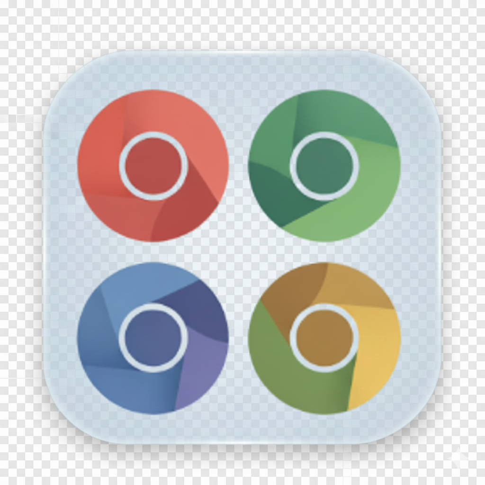

# MultiChrome - Chrome 多环境管理工具

<div align="center">



[](https://opensource.org/licenses/MIT)
[](https://github.com/jiffies/multichrome)
[](https://github.com/jiffies/multichrome/releases)

一个基于 Electron 的跨平台 Chrome 多环境管理工具,让你轻松管理多个完全隔离的 Chrome 浏览器环境。

[English](README_EN.md) | 简体中文

</div>

## ✨ 特性

- 🌍 **跨平台支持** - 完全支持 Windows、macOS 和 Linux
- 🔐 **完全隔离** - 每个环境拥有独立的 Cookie、扩展、书签和设置
- 🗂️ **分组管理** - 按项目或用途对环境进行分组
- 🏷️ **标签系统** - 为环境添加自定义标签便于筛选
- 🗑️ **回收站** - 误删除?没问题!支持环境恢复
- 🌐 **代理支持** - 为每个环境配置独立代理或使用全局代理
- 💼 **钱包管理** - 记录每个环境关联的钱包地址
- ⚙️ **灵活配置** - 自定义数据存储路径、启动页等
- 🎨 **现代 UI** - 基于 GitHub Primer 设计系统的美观界面
- 📱 **响应式设计** - 支持各种屏幕尺寸,包括超宽屏

## 📸 截图

<!-- 在这里添加应用截图 -->

## 🚀 快速开始

### 安装

#### 方式一: 下载预编译版本 (推荐)

从 [Releases](https://github.com/jiffies/multichrome/releases) 页面下载适合你系统的安装包:

- **Windows**: `MultiChrome-Setup-x.x.x.exe`
- **macOS**: `MultiChrome-x.x.x.dmg` 或 `MultiChrome-x.x.x-mac.zip`
- **Linux**: `MultiChrome-x.x.x.AppImage` 或 `multichrome_x.x.x_amd64.deb`

#### 方式二: 从源码构建

```bash
# 克隆仓库
git clone https://github.com/jiffies/multichrome.git
cd multichrome

# 安装依赖
npm install

# 开发模式运行
npm run dev

# 或者构建并打包
npm run build
npm run package:win   # Windows
npm run package:mac   # macOS
npm run package:linux # Linux
```

### 前置要求

- Chrome 浏览器已安装
- **Windows**: Windows 10 或更高版本
- **macOS**: macOS 10.15 (Catalina) 或更高版本
- **Linux**: 支持 AppImage 或 deb 包的发行版

## 📖 使用指南

### 创建环境

1. 点击"创建新环境"按钮
2. 填写环境名称和分组
3. (可选) 添加备注、钱包地址、标签等
4. 点击"创建"

### 启动环境

点击环境卡片上的"启动"按钮,将打开一个独立的 Chrome 窗口。该环境的所有数据都与其他环境完全隔离。

### 配置代理

**全局代理**: 在设置中配置全局代理,所有未配置独立代理的环境都会使用全局代理。

**环境代理**: 在环境详情中配置独立代理,优先级高于全局代理。

代理格式示例:
```
http://127.0.0.1:7890
socks5://127.0.0.1:1080
```

### 管理环境

- **编辑**: 点击环境卡片查看详情并编辑
- **删除**: 删除的环境会进入回收站,可以恢复
- **永久删除**: 在回收站中彻底删除环境

## 🏗️ 技术架构

### 技术栈

**前端**
- React 18 - UI 框架
- TypeScript - 类型安全
- Primer React - GitHub 设计系统
- Tailwind CSS - 样式工具

**后端 (Electron)**
- Electron - 桌面应用框架
- Better SQLite3 - 数据存储
- Electron Store - 配置管理
- Electron Log - 日志系统

**构建工具**
- Vite - 前端构建
- Electron Builder - 应用打包
- ESLint - 代码检查

### 项目结构

```
multichrome/
├── electron/              # Electron 主进程
│   ├── main.ts           # 应用入口
│   ├── chromeManager.ts  # Chrome 环境管理
│   ├── settingsManager.ts # 设置管理
│   └── cdpManager.ts     # Chrome DevTools Protocol
├── src/                  # React 渲染进程
│   ├── components/       # UI 组件
│   ├── contexts/         # React Context
│   ├── types/           # TypeScript 类型
│   └── App.tsx          # 应用根组件
├── assets/              # 静态资源
└── .github/             # GitHub 配置
```

### 跨平台实现

- **进程管理**: Windows 使用 PowerShell + WMI,macOS/Linux 使用 ps 命令
- **路径处理**: 使用 Node.js path 模块确保跨平台兼容
- **Chrome 检测**: 针对不同平台的标准安装路径自动检测

## 🔧 开发

### 开发环境要求

- Node.js 18+
- npm 8+
- Git

### 开发命令

```bash
# 启动开发服务器 (热重载)
npm run dev

# 仅启动前端
npm run dev:vite

# 仅启动 Electron
npm run dev:electron

# 代码检查
npm run lint
npm run lint:fix

# 构建
npm run build
npm run build:vite      # 仅构建前端
npm run build:electron  # 仅构建 Electron

# 打包
npm run package:win     # Windows
npm run package:mac     # macOS
npm run package:linux   # Linux
```

### 贡献指南

我们欢迎所有形式的贡献!请查看 [CONTRIBUTING.md](CONTRIBUTING.md) 了解详情。

**贡献流程:**
1. Fork 本仓库
2. 创建特性分支 (`git checkout -b feature/AmazingFeature`)
3. 提交更改 (`git commit -m 'feat: 添加某个功能'`)
4. 推送到分支 (`git push origin feature/AmazingFeature`)
5. 创建 Pull Request

### 提交规范

我们使用 [Conventional Commits](https://www.conventionalcommits.org/) 规范:

- `feat`: 新功能
- `fix`: Bug 修复
- `docs`: 文档更新
- `style`: 代码格式
- `refactor`: 重构
- `test`: 测试
- `chore`: 构建/工具

## 🐛 问题报告

如果你遇到问题,请在 [Issues](https://github.com/jiffies/multichrome/issues) 中报告,并提供:

- 操作系统和版本
- MultiChrome 版本
- Chrome 版本
- 详细的重现步骤
- 日志文件 (位于 `%APPDATA%/multichrome/logs`)

## 📝 待办事项

- [ ] 环境导入/导出功能
- [ ] 环境克隆功能
- [ ] 批量操作支持
- [ ] 环境使用统计
- [ ] 自动更新功能
- [ ] 多语言支持 (i18n)
- [ ] 环境备份与同步

## 📄 许可证

本项目采用 MIT 许可证 - 查看 [LICENSE](LICENSE) 文件了解详情。

## 🙏 致谢

- [Electron](https://www.electronjs.org/) - 跨平台桌面应用框架
- [React](https://react.dev/) - 用户界面库
- [Primer React](https://primer.style/react/) - GitHub 设计系统
- [Better SQLite3](https://github.com/WiseLibs/better-sqlite3) - SQLite 绑定

## 📞 联系方式

- 项目主页: [https://github.com/jiffies/multichrome](https://github.com/jiffies/multichrome)
- 问题反馈: [https://github.com/jiffies/multichrome/issues](https://github.com/jiffies/multichrome/issues)

---

<div align="center">

**如果这个项目对你有帮助,请给我们一个 ⭐️!**

Made with ❤️ by MultiChrome Contributors

</div>
